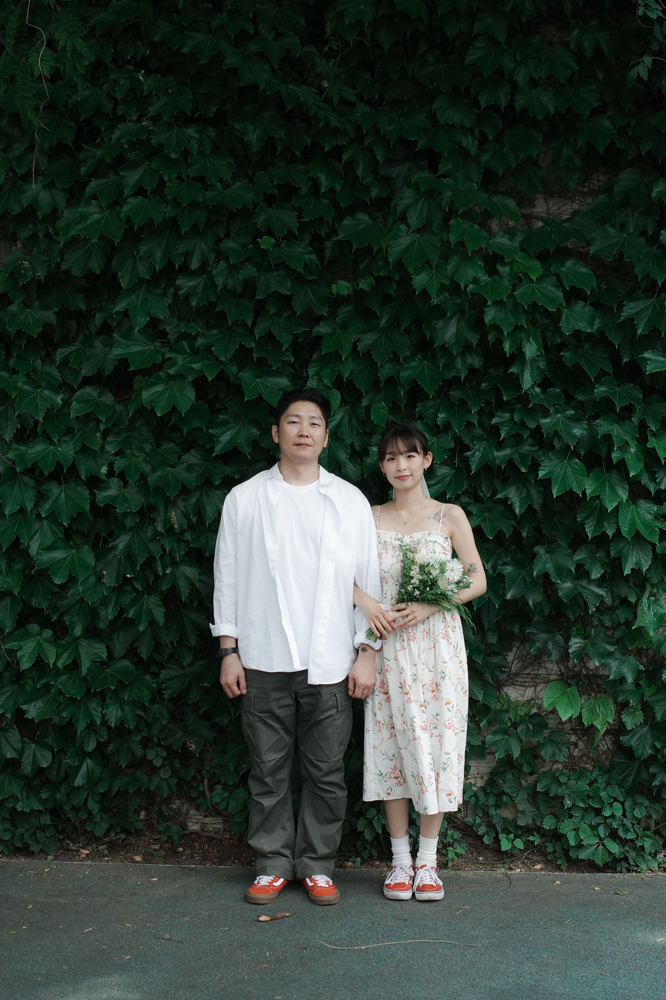

<!DOCTYPE html>
<html lang="en">
<head>
    <meta charset="UTF-8">
    <meta name="viewport" content="width=device-width, initial-scale=1.0">
    <link rel="stylesheet" href="/style.css">
    <title>Document</title>
</head>
<body style="background:linear-gradient(to bottom, #ff3d87, white,#6bc2ff);margin: auto;text-align: center;">
    

        <h1 style="font-size: 5rem;color: white; letter-spacing: -4px;">power of love!</h1>

        

            
        

        

            <h5 style="text-align: center;font-size: 2rem;">
                김법승♥문연주
            </h5>
            

                <b>6년의 만남 동안 매일매일이 즐겁고 행복했습니다. 
                함께 있을 때에는 그 무엇도 두렵지 않고 
                뭐든 다 해낼 수 있을 것 같은 용기마저 두둑해집니다. 
                이제는 둘이 평생을 함께 하며 
                하루하루를 용기 있게, 즐겁고 행복하게 지내보려 합니다. 
                 
                평생 함께하겠노라 약속하는 자리에 
                부디 함께 하시어 축복해 주시면 감사하겠습니다.  
                법승 연주 올림
            </b>

        

        

    

</body>
</html>
